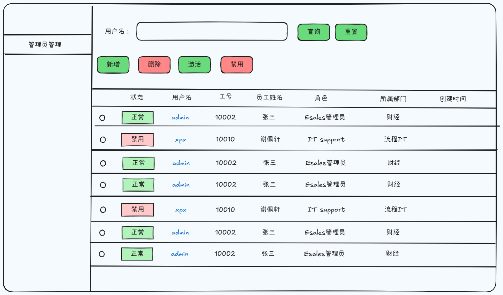

[ERROR] [NoMatchingRenderer] Unable to render `ChevronDown`.


 ```css title="PowerShell Profile.ps1"
console.log('This code is syntax highlighted!')
```

```ansi
Standard ANSI colors:
- Dimmed:      Black  Red  Green  Yellow  Blue  Magenta  Cyan  White 
- Foreground:  Black  Red  Green  Yellow  Blue  Magenta  Cyan  White 
- Background:  Black  Red  Green  Yellow  Blue  Magenta  Cyan  White 
- Reversed:    Black  Red  Green  Yellow  Blue  Magenta  Cyan  White 

8-bit colors (showing colors 160-171 as an example):
- Dimmed:      160  161  162  163  164  165  166  167  168  169  170  171 
- Foreground:  160  161  162  163  164  165  166  167  168  169  170  171 
- Background:  160  161  162  163  164  165  166  167  168  169  170  171 
- Reversed:    160  161  162  163  164  165  166  167  168  169  170  171 

24-bit colors (full RGB):
- Dimmed:      ForestGreen - RGB(34,139,34)  RebeccaPurple - RGB(102,51,153) 
- Foreground:  ForestGreen - RGB(34,139,34)  RebeccaPurple - RGB(102,51,153) 
- Background:  ForestGreen - RGB(34,139,34)  RebeccaPurple - RGB(102,51,153) 
- Reversed:    ForestGreen - RGB(34,139,34)  RebeccaPurple - RGB(102,51,153) 

Font styles:
- Default
- Bold
- Dimmed
- Italic
- Underline
- Reversed
- Strikethrough
```


